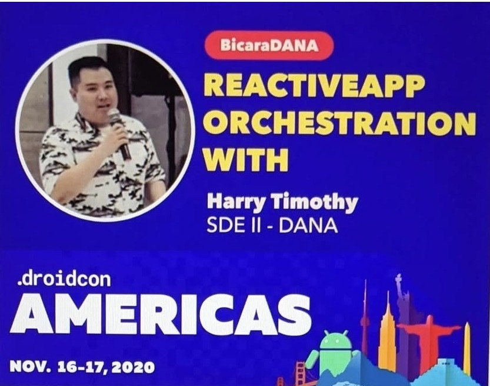
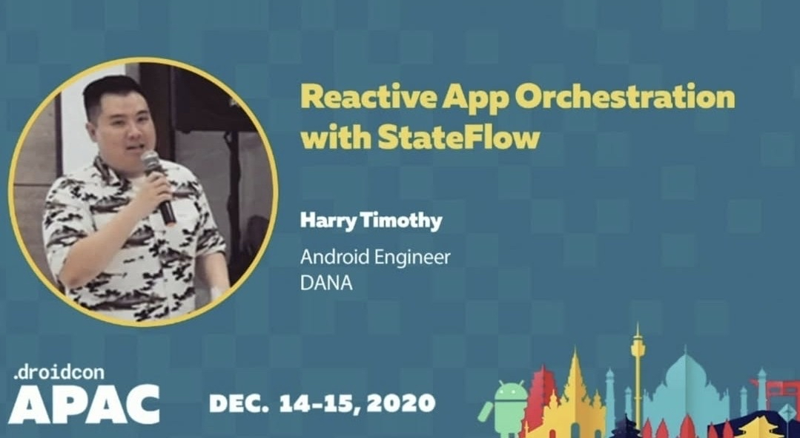
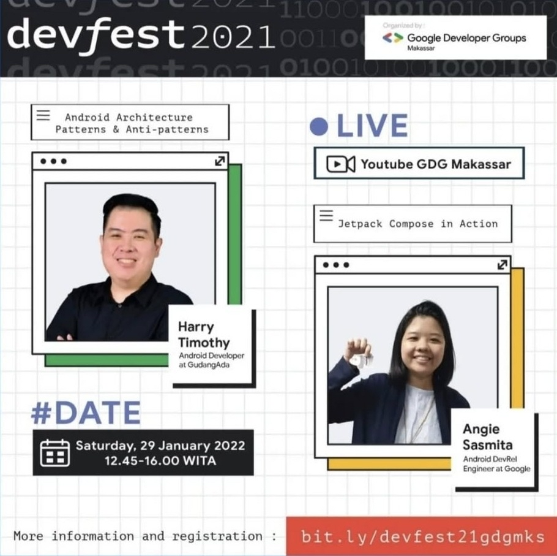

## Introduction

I'm an Android engineer obsessed with performance. In early 2025, I deleted my old projects after realizing they didn't fully reflect the degree of system-level engineering and competitiveness I wanted to showcase 😄

Rather than shipping another feature-driven app, I started building SDKs where performance & architectural trade-offs can be compared and reasoned about explicitly.

Open to senior Android roles where system design and performance are top priorities.

## Featured Projects

- **[SafeBox](https://github.com/harrytmthy/safebox)**  
  A high-performance encrypted key-value store for Android.  
  
  
  

- **[Stitch](https://github.com/harrytmthy/stitch)**   
  A Kotlin Multiplatform dependency injection library with top-tier performance and runtime flexibility.  
  
  

## Talks

I've shared insights and best practices on Android development at several notable events, including:

  
Droidcon Americas 2020: Reactive App Orchestration with StateFlow

   
  

  
Droidcon APAC 2020: Reactive App Orchestration with StateFlow

   
  

  
GDG Makassar DevFest 2021: Android Architecture Patterns & Anti-patterns

   
  

  
Bangkit Academy 2021: Building Reactive Apps

   
  

## Support

If my work helped you, please ⭐️ the repo or consider [sponsoring](https://github.com/sponsors/harrytmthy).
