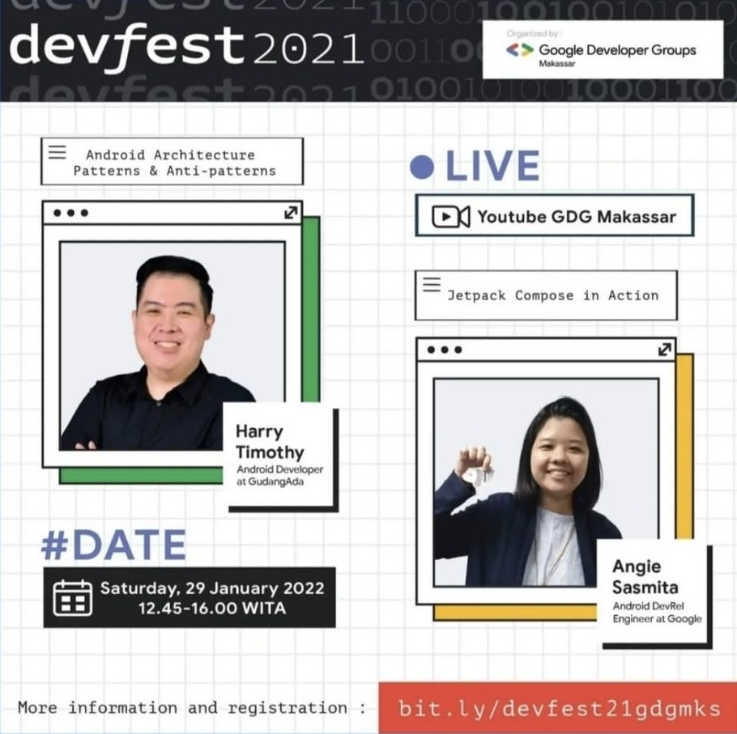
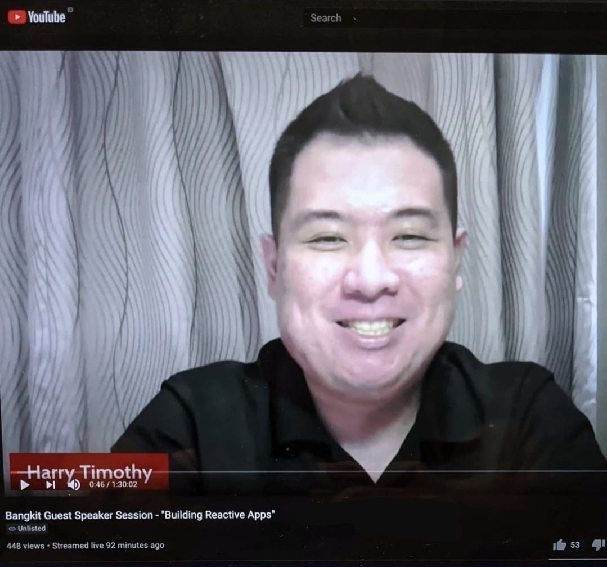

# Hi, I'm Harry Timothy!

I'm an Android engineer who is obsessed with performance improvement. I build apps & SDKs with a system-first mindset and clear tradeoffs.

**Creator of [**SafeBox**](https://github.com/harrytmthy/safebox)**, a secure and fast encrypted storage library for Android.

## Featured Projects

- **[SafeBox](https://github.com/harrytmthy/safebox)**  
  A high-performance encrypted key-value store for Android.  
  
  
  

- **[Stitch](https://github.com/harrytmthy/stitch)**  
  _(coming soon)_

## Talks

I've shared insights and best practices on Android development at several notable events, including:

  
Droidcon Americas 2020: Reactive App Orchestration with StateFlow

   
  

  
Droidcon APAC 2020: Reactive App Orchestration with StateFlow

   
  

  
GDG Makassar DevFest 2021: Android Architecture Patterns & Anti-patterns

   
  

  
Bangkit Academy 2021: Building Reactive Apps

   
  

## Support

If my work helped you, please ⭐️ the repo or consider [sponsoring](https://github.com/sponsors/harrytmthy).
